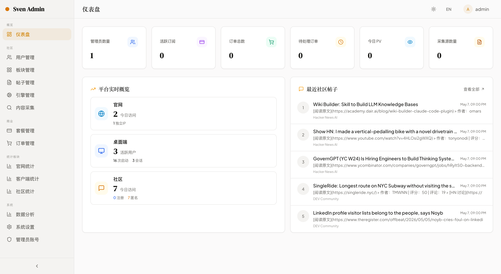

# Sven Family

[English](README.md) | [中文](README.zh-CN.md)

<p align="center">
  
  
  
  
</p>

**Sven Family** is an AI-native product suite that connects creation, collaboration, publishing, and operations into one integrated platform.

---

## Table of Contents

- [What's Inside](#whats-inside)
- [Preview](#preview)
- [Project Structure](#project-structure)
- [Tech Stack](#tech-stack)
- [Quick Start](#quick-start)
- [Service Map](#service-map)
- [Documentation](#documentation)
- [Contributing](#contributing)
- [License](#license)

---

## What's Inside

Sven Family combines four product experiences with shared backend services:

| Module | Description |
|--------|-------------|
| **Studio** | Build and run AI workflows in a visual editor (web + desktop) |
| **Community** | Knowledge sharing and team discussions |
| **Site** | Publish product-facing pages and content experiences |
| **Admin** | Operate content, users, data, and services from a unified dashboard |
| **Butler** | Backend services for crawling, stats, and cross-service orchestration |

Core value:

- One platform for creators, operators, and community members
- End-to-end flow from content generation to distribution and governance
- Extensible architecture for multi-app and multi-service growth

---

## Preview

### Studio


### Community


### Site


### Butler



---

## Project Structure

```
sven/
├── frontend/
│   ├── admin-frontend/    # Admin dashboard (Vite + React)
│   ├── community/         # Community web app (Next.js)
│   └── site/              # Landing / product site (Next.js)
├── backend/
│   ├── admin-backend/     # Admin API service (Python)
│   ├── community-backend/ # Community API service (Python)
│   ├── crawler/           # Data collection service (Python)
│   └── stats-service/     # Analytics service (Python)
├── studio/
│   ├── frontend/          # Studio web editor
│   ├── desktop/           # Studio desktop app (Electron)
│   └── backend/           # Studio API service (Python)
└── assets/                # Documentation images and static resources
```

---

## Tech Stack

| Layer | Technology |
|-------|-----------|
| **Monorepo** | Turborepo + pnpm workspace |
| **Frontend** | Next.js, React, Vite, Tailwind CSS, TypeScript |
| **Desktop** | Electron |
| **Backend** | Python 3.11+, FastAPI, SQLAlchemy (async) |
| **Database** | PostgreSQL 15 |
| **Cache** | Redis 7 |
| **Migrations** | Alembic |
| **DevOps** | Docker, Docker Compose |

---

## Quick Start

### Prerequisites

- **Node.js** >= 20
- **pnpm** >= 11
- **Python** >= 3.11
- **uv** (recommended Python package manager)
- **Docker & Docker Compose** (recommended for full-stack development)
- **PostgreSQL 15** and **Redis 7** (provided via Docker)

### 1. Clone and Install

```bash
git clone https://github.com/laishiwen/sven-family.git
cd sven-family
pnpm install
```

### 2. Environment Configuration

Copy the example environment files for the backend services you plan to run:

```bash
cp backend/admin-backend/.env.example backend/admin-backend/.env
cp backend/community-backend/.env.example backend/community-backend/.env
cp backend/crawler/.env.example backend/crawler/.env
cp backend/stats-service/.env.example backend/stats-service/.env
```

Edit each `.env` file with your local database credentials and secrets.

### 3. Start Infrastructure (Database & Cache)

```bash
docker compose up -d postgres redis
```

### 4. Run Database Migrations

```bash
cd backend/admin-backend && uv run alembic upgrade head
```

### 5. Start Development

```bash
# Start everything (requires all .env files configured)
pnpm dev

# Frontend only
pnpm dev:front

# Backend services only
pnpm dev:back

# Start with Docker Compose (full stack)
pnpm dev:docker
```

### 6. Access the Apps

| App | URL |
|-----|-----|
| Studio | http://localhost:3000 |
| Site | http://localhost:3001 |
| Community | http://localhost:3002 |
| Admin | http://localhost:5174 |

### Stop Services

```bash
pnpm dev:stop
```

---

## Service Map

| Service | Port | Description |
|---------|------|-------------|
| Studio Web | 3000 | Studio frontend |
| Studio API | 8000 | Studio backend |
| Site | 3001 | Landing / product site |
| Community | 3002 | Community frontend |
| Community API | 50051 | Community public API |
| Community Admin | 50052 | Community admin API |
| Admin Frontend | 5174 | Admin dashboard |
| Admin API | 8001 | Admin backend |
| Stats Service | 8002 | Analytics API |
| Data Collection | 9100 | Data collection service |
| PostgreSQL | 5432 | Primary database |
| Redis | 6379 | Cache & queue |

---

## Documentation

- [Contributing Guide](CONTRIBUTING.md)
- [Code of Conduct](CODE_OF_CONDUCT.md)
- [Security Policy](SECURITY.md)
- [Roadmap](ROADMAP.md)
- [Changelog](CHANGELOG.md)

---

## Contributing

We welcome contributions. Please read the [Contributing Guide](CONTRIBUTING.md) before submitting a pull request.

By contributing, you agree that your contributions will be licensed under the MIT License.

---

## License

This project is licensed under the [MIT License](LICENSE).

---

## Acknowledgements

Thanks to all [contributors](https://github.com/laishiwen/sven-family/graphs/contributors) and the open-source communities behind Node.js, Python, React, Next.js, Vite, Tailwind CSS, and FastAPI.
