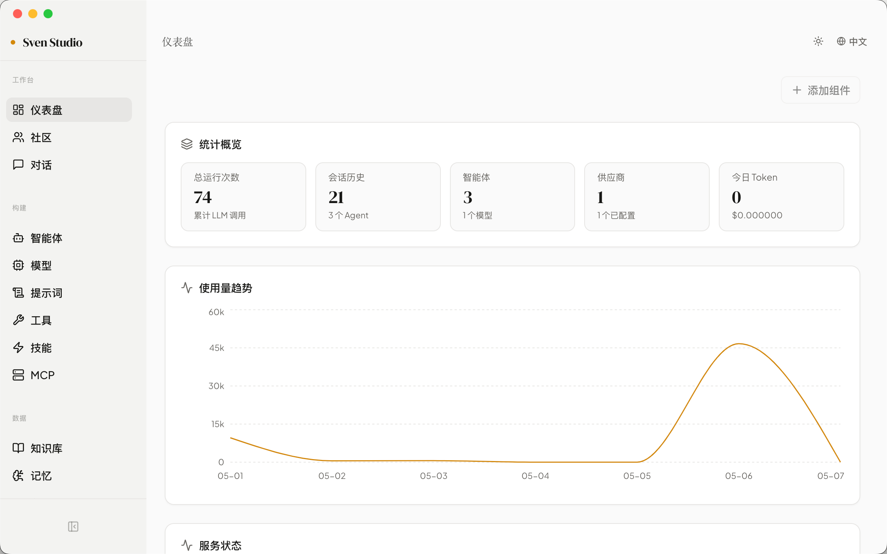
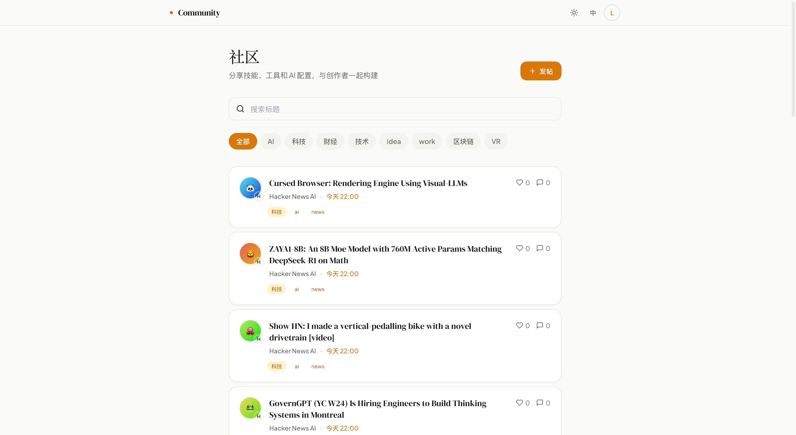

# Sven Family

[English](README.md) | [中文](README.zh-CN.md)

<p align="center">
  
  
  
  
</p>

**Sven Family** 是面向创作者与团队的 AI 原生产品套件，将创作、协作、发布与运营连接为一体化平台。

---

## 目录

- [产品概览](#产品概览)
- [预览](#预览)
- [项目结构](#项目结构)
- [技术栈](#技术栈)
- [快速开始](#快速开始)
- [服务端口](#服务端口)
- [文档](#文档)
- [参与贡献](#参与贡献)
- [开源协议](#开源协议)

---

## 产品概览

Sven Family 将四款产品体验与共享后端服务整合为一体：

| 模块          | 说明                                       |
| ------------- | ------------------------------------------ |
| **Studio**    | 可视化构建与运行 AI 工作流（Web + 桌面端） |
| **Community** | 知识沉淀与团队社区协作                     |
| **Site**      | 对外发布产品页面与内容体验                 |
| **Admin**     | 统一管理后台：内容、用户、数据与服务运营   |
| **Crawler**   | 数据采集与内容入库管线                     |
| **Stats**     | 使用分析与指标聚合服务                     |

核心价值：

- 一个平台承载创作者、运营者与社区成员协同
- 贯通从内容生成到分发治理的端到端流程
- 支持多应用与多服务持续扩展的架构能力

---

## 预览

### Studio



### Community [↗](https://club.sven-family.asia)



### Site [↗](https://www.sven-family.asia)


### Admin [↗](https://admin.sven-family.asia)


---

## 项目结构

```
sven/
├── frontend/
│   ├── admin-frontend/    # 管理后台 (Vite + React)
│   ├── community/         # 社区前端 (Next.js)
│   └── site/              # 官网 / 产品站 (Next.js)
├── backend/
│   ├── admin-backend/     # 管理后台 API (Python)
│   ├── community-backend/ # 社区 API (Python)
│   ├── crawler/           # 数据采集服务 (Python)
│   └── stats-service/     # 统计分析服务 (Python)
├── studio/
│   ├── frontend/          # Studio 可视化编辑器
│   ├── desktop/           # Studio 桌面端 (Electron)
│   └── backend/           # Studio API (Python)
└── assets/                # 文档图片与静态资源
```

---

## 技术栈

| 层级         | 技术                                           |
| ------------ | ---------------------------------------------- |
| **Monorepo** | Turborepo + pnpm workspace                     |
| **前端**     | Next.js、React、Vite、Tailwind CSS、TypeScript |
| **桌面端**   | Electron                                       |
| **后端**     | Python 3.11+、FastAPI、SQLAlchemy（异步）      |
| **数据库**   | PostgreSQL 15                                  |
| **缓存**     | Redis 7                                        |
| **数据迁移** | Alembic                                        |
| **DevOps**   | Docker、Docker Compose                         |

---

## 快速开始

### 环境要求

- **Node.js** >= 20
- **pnpm** >= 11
- **Python** >= 3.11
- **uv**（推荐的 Python 包管理器）
- **Docker & Docker Compose**（推荐，用于全栈开发）
- **PostgreSQL 15** 和 **Redis 7**（通过 Docker 提供）

### 1. 克隆并安装

```bash
git clone https://github.com/laishiwen/sven-family.git
cd sven-family
pnpm install
```

### 2. 配置环境变量

为需要启动的后端与前端服务复制示例环境变量文件：

```bash
# 后端
cp backend/admin-backend/.env.example backend/admin-backend/.env
cp backend/community-backend/.env.example backend/community-backend/.env
cp backend/crawler/.env.example backend/crawler/.env
cp backend/stats-service/.env.example backend/stats-service/.env

# 前端
cp frontend/community/.env.example frontend/community/.env
cp frontend/site/.env.example frontend/site/.env
cp studio/frontend/.env.example studio/frontend/.env
```

根据本地环境编辑各 `.env` 文件中的数据库连接信息与密钥。

### 3. 启动基础设施（数据库与缓存）

```bash
docker compose up -d postgres redis
```

### 4. 执行数据库迁移

```bash
cd backend/admin-backend && uv run alembic upgrade head
cd ../community-backend && uv run alembic upgrade head
```

### 5. 启动开发环境

```bash
# 启动全部前端
pnpm dev

# 启动 Studio（Web + API）
pnpm dev:studio:full

# 启动全部前端
pnpm dev:front

# 启动全部后端服务
pnpm dev:back

# 使用 Docker Compose 启动全栈
pnpm dev:docker
```

### 6. 访问应用

| 应用      | 地址                  |
| --------- | --------------------- |
| Studio    | http://localhost:3000 |
| Site      | http://localhost:3001 |
| Community | http://localhost:3002 |
| Admin     | http://localhost:5174 |

### 停止服务

```bash
pnpm dev:stop
```

---

## 服务端口

| 服务            | 端口  | 说明           |
| --------------- | ----- | -------------- |
| Studio Web      | 3000  | Studio 前端    |
| Studio API      | 8000  | Studio 后端    |
| Site            | 3001  | 官网 / 产品站  |
| Community       | 3002  | 社区前端       |
| Community API   | 50051 | 社区公开 API   |
| Community Admin | 50052 | 社区管理 API   |
| Admin Frontend  | 5174  | 管理后台前端   |
| Admin API       | 8001  | 管理后台 API   |
| Stats Service   | 8002  | 统计分析 API   |
| Crawler         | 9100  | 数据采集服务   |
| PostgreSQL      | 5432  | 主数据库       |
| Redis           | 6379  | 缓存与消息队列 |

---

## 文档

- [贡献指南](CONTRIBUTING.zh-CN.md)
- [行为准则](CODE_OF_CONDUCT.zh-CN.md)
- [安全策略](SECURITY.md)
- [路线图](ROADMAP.md)
- [更新日志](CHANGELOG.md)

---

## 参与贡献

欢迎参与贡献。提交 Pull Request 前请先阅读[贡献指南](CONTRIBUTING.zh-CN.md)。

提交贡献即表示你同意相关代码在 MIT 协议下发布。

---

## 开源协议

本项目基于 [MIT License](LICENSE) 开源。

---

## 致谢

感谢所有[贡献者](https://github.com/laishiwen/sven-family/graphs/contributors)以及 Node.js、Python、React、Next.js、Vite、Tailwind CSS、FastAPI 等开源社区。
